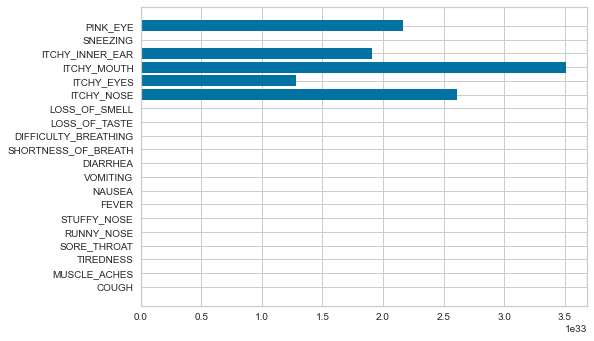

# Prediction/Forecasting: Experimenting with MindsDB & Python Classification Algorithms
**OBJECTIVE-**  To solve Classification problem where we have to predict the `Diagnose(COVID,ALLERGEY,COLD,FLU)` and predict the chances of a `Heart attack` using `MindsDB and Python`
## Table of Contents
  - [Classification](#what-is-classification)    
  - [MindsDB](#what-is-mindsdb)  
  - [Python Implementation](#python-implementation)  
  - [Evalution Metrics](#evaluation-metrics)  
  - [Comparing Results](#interpreting-the-results-of-mindsdb-and-logistic-regression)   
  - [Feature Importance](#what-is-feature-importance)  
  - [Summary](#conclusion)  
 
## What is Classification?  
In machine learning, classification refers to a predictive modeling problem where a class label is predicted for a given example of input data.Use the optimal clasification algorithm to predict the result.There are perhaps four main types of classification tasks that you may encounter; they are:  
-Binary Classification  
-Multi-Class Classification  
-Multi-Label Classification  
-Imbalanced Classification  

**What is Binary Classification?**    
`Binary classification` is the simplest kind of machine learning problem. 
The goal of binary classification is to categorise data points into one of two buckets: 0 or 1, true or false, to survive or not to survive, blue or no blue eyes, etc.  
Popular algorithms that can be used for binary classification include:  
-Logistic Regression  
-k-Nearest Neighbors  
-Decision Trees  
-Support Vector Machine  
-Naive Bayes  
**What is Multi-class Classification?**      
In machine learning, `multiclass or multinomial classification` is the problem of classifying instances into one of three or more classes.  
Popular algorithms that can be used for multi-class classification include:  
-k-Nearest Neighbors.  
-Decision Trees.  
-Naive Bayes.  
-Random Forest.  
-Gradient Boosting.  
<hr>

## What is [MindsDB](https://mindsdb.com/)?  
MindsDB is an open-source AI layer for existing databases that allows you to effortlessly develop, train and deploy state-of-the-art machine learning models using SQL queries. With MindsDB any developer, analyst or data scientist can automatically build and deploy Machine Learning models from inside the databases in minutes using a graphical user interface or plain SQL.  

### How to [setup](https://docs.mindsdb.com/) MindsDB?  
In this project we used mysqldb and mindsdb - python native
-For [MySQL DB](https://www.mysql.com/downloads/) installation
-For [Python Native](https://docs.mindsdb.com/JupyterNotebook/)    
  ```
  !pip install mindsdb_native
  ```
  Python native is used in this module.  

### How to [import](https://docs.mindsdb.com/datasources/mysql/) your data?
The database dump is provided in the repo, import it using your mysqli command line or the workbench.  
The data source can be a file, data frame or a MindsDB data source.
In this module we use [MySQL_DS](https://docs.mindsdb.com/features/DataSources/#mysqlds) & [MySQL DB](https://docs.mindsdb.com/datasources/mysql/)  
Note: Install mindsdb python native prior to using mysql ds
```
!pip install mindsdb_native

from mindsdb_native import Predictor, MySqlDS
```  

### How to [train](https://docs.mindsdb.com/model/mysql/) the model and predict data?
Using MySQL:  
To train a new model, you will need to INSERT a new record inside the mindsdb.predictors table.
The INSERT query for training new model is quite simple, e.g.:
```
INSERT INTO mindsdb.predictors(name, predict, select_data_query)
VALUES('model_name', 'target_variable', 'SELECT * FROM table_name');
```
To check that the training finished successfully, you can SELECT from the mindsdb.predictors table and get the training status, e.g.:
```
SELECT * FROM mindsdb.predictors WHERE name='<model_name>';
```
Using Python native:
```
#The dataset is split into train and test data frames.  
model = Predictor(name=<modelName>)
model.learn(from_data=train_data, to_predict=<targetColumn>)
predictions = model.predict(when_data=test_data)
```  

## Python Implementation     
We first have the Pre-Processing of the data, then we have the Machine Learning aspect of it where we train the model using the data and finally, we have the prediction where we give x data into the model to return a prediction after training the model with a pre-existing data set. 
**Pre-Processing**  

We can think of DataFrames as a 2D structure or like a 2D array of kinds that has a row and a column. We use a DataFrame here to load the .csv data to be used by the program. We can use this with the help of the pandas library.
```
import pandas as pd
df = pd.read_csv('sampleDataset.csv')
```
There are a few things that we do with this DataFrame before we're ready to train our model. This is called pre-processing. During pre-processing, we help clean our dataset. This helps is providing a more accurate and clean model execution.  

We use the shape function from pandas to return the number of rows and colums in the DataFrame.
```
df.shape
```

The dropna function can be used to trim the empty data. Dropna is used to drop rows where at least one row is missing.
```
df.dropna()
```

After this, we can compare the value from the original DataFrame that we got using shape function with the value from the shape function after using Dropna. We can find that there's almost some reduction in the number of rows in the DataFrame now. 

Now we check the dataset. If there are Yes and No values in the columns, we replace them with 1's and 0's since models understand only numbers. To do so, we use the replace function.
```
df['col_name'].replace({'No': 0, 'Yes': 1}, inplace =  True)
```
**Training**

Now that we're done with pre-processing the data, we can now train our model. Before that we need to split our data into training data and testing data. To do so we use the train_test_split() function from sklearn model selection. 

```
from sklearn.model_selection import train_test_split
x_train, x_test, y_train, y_test  =  train_test_split(x, y, test_size=0.20, random_state=42)
```

In the above line, we split the data into training and testing data where 80% of the data is used for training while 20% is used for testing.
We also shuffle our data to prevent any bias.

**What is bias?**  
We can think of Bias as the accuracy in our predictions. If there exists a high bias, it can cause our prediction to be inaccurate. 

_"Bias is the  algorithm's tendency to consistently learn the wrong thing by not taking into account all the information in the data(underfitting)."_ - Foreman

Parametric algorithms are prone to high bias. A parametric algorithm has a set number of parameters it considers to train the data. Example of high-bias algorithms are Linear Regression, Linear Discriminant Analysis, and Logistic Regression.
 
After this we can build our model with any of the ML algorithms we choose.
 
`fit()` is implemented by every estimator and it accepts an input in its parameters like the sample data and its argument for labels. It can also take additional parameters like weights etc. 
The fit method typically start with clearing any attributes already stored on the estimator and then perform parameter and data validation. They also are responsible for estimating the attr. out of the input data and store the model attr. and finally return the fitted estimator. 

Algorithms that can be used for Multi-class classification problems:  
**1. K-Nearest Neighbors:**    
The k-nearest neighbors (KNN) algorithm is a simple, easy-to-implement supervised machine learning algorithm that can be used to solve both classification and regression problems. 
It’s easy to implement and understand, but has a major drawback of becoming significantly slows as the size of that data in use grows. 

**USE:** The KNN algorithm can compete with the most accurate models because it makes highly accurate predictions.
Therefore, you can use the KNN algorithm for applications that require high accuracy but that do not require a human-readable model.

**2. Decision Trees:**  
Decision Tree is a Supervised learning technique that can be used for both classification and Regression problems, but mostly it is preferred for solving Classification problems.It is a tree-structured classifier, where internal nodes represent the features of a dataset, branches represent the decision rules and each leaf node represents the outcome.  

**USE:** Decision trees are commonly used in operations research and operations management. If, in practice, decisions have to be taken online with no recall under incomplete knowledge, a decision tree should be paralleled by a probability model as a best choice model or online selection model algorithm.

**3. Naive Bayes:**  
It is a classification technique based on Bayes' Theorem with an assumption of independence among predictors. 
In simple terms, a Naive Bayes classifier assumes that the presence of a particular feature in a class is unrelated to the presence of any other feature. 

**USE:** When assumption of independence holds, a Naive Bayes classifier performs better compare to other models like logistic regression and you need less training data.
It perform well in case of categorical input variables compared to numerical variable(s).

**4. Random forest:**  
Random Forest is a popular machine learning algorithm that belongs to the supervised learning technique. It can be used for both Classification and Regression problems in ML. 
It is based on the concept of ensemble learning, which is a process of combining multiple classifiers to solve a complex problem and to improve the performance of the model.  

**USE:** It provides higher accuracy through cross validation. Random forest classifier will handle the missing values and maintain the accuracy of a large proportion of data.

**5. Gradient Boosting:**  
Gradient boosting is a greedy algorithm and can overfit a training dataset quickly.It can benefit from regularization methods that penalize various parts of the algorithm and generally improve the performance of the algorithm by reducing overfitting.  

**USE:** Gradient boosting is typically used with decision trees (especially CART trees) of a fixed size as base learners. For this special case, Friedman proposes a modification to gradient boosting method which improves the quality of fit of each base learner.  


Out of these models, Logistic Regression gives the highest accuracy.  

## Evaluation Metrics
Now to **evaluate** how accurate our model is, we can use different metrics but here we'll use accuracy score.   

**What is Confusion Matrix?**      
A `Confusion matrix` is an N x N matrix used for evaluating the performance of a classification model, where N is the number of target classes. The matrix compares the actual target values with those predicted by the machine learning model. This gives us a holistic view of how well our classification model is performing and what kinds of errors it is making.  
* True Positive (TP)  
The predicted value matches the actual value  
The actual value was positive and the model predicted a positive value  
* True Negative (TN)  
The predicted value matches the actual value  
The actual value was negative and the model predicted a negative value  
* False Positive (FP) – Type 1 error  
The predicted value was falsely predicted  
The actual value was negative but the model predicted a positive value  
Also known as the Type 1 error  
* False Negative (FN) – Type 2 error  
The predicted value was falsely predicted  
The actual value was positive but the model predicted a negative value  
Also known as the Type 2 error  

**What is ?**  
<u>**Accuracy**</u> Score produces a result according to the sum of the number of times our model predicted no correctly(True Negative) and yes correctly(True Positive) by the total number of predictions.
```
from sklearn.metrics import accuracy_score
score = accuracy_score(y_test, y_pred)
```
The higher the accuracy score is, the better and more accurate our model is and so are our predictions. 

**What is ?**    
<u>**Precision Score**</u> is the ratio of correctly predicted positive observations to the total predicted positive observations. High precision rates to the low false positive rate.  

```
from sklearn.metrics import precision_score
precision_score(y_test, y_pred, average='None')
```
The precision is intuitively the ability of the classifier not to label as positive a sample that is negative.

**What is ?**    
<u>**Recall Score**</u> is the ratio of correctly predicted positive observarions to the all observations. It's a metric that quantifies the number of correct positive predictions made out of all positive predictions that could have been made. 

```
from sklearn.metrics import recall_score
recall_score(y_test, y_pred)
```
It is intuitively the ability of the classifier to find all the positive samples.

**What is ?**    
<u>**F1 Score**</u> is the weighted average of precision and recall scores. Therefore, this score takes both false positives and false negatives into accout.

```
from sklearn.metrics import f1_score
f1_score(y_test, y_pred)
```
Intuitively, it's not easy to understand as accuract, but F1 is usually more useful than accuracy, especially if there's an uneven class distribution.  


### Interpreting the results of Mindsdb and Logistic Regression  
`Logistic regression` Python Implementation results  
```
model.score(x_test,y_test)
0.9297700994286229

cm=confusion_matrix(y_test,y_pred)
array([[ 8166,    46,     8,    21],
       [  197,   258,    13,    32],
       [    8,    11,   612,   338],
       [   60,   116,   711, 11630]], dtype=int64)
 
precision, recall, fscore, support = score(y_test,y_pred)
precision: [0.96856838 0.59860789 0.45535714 0.96747359]
recall:    [0.99089916 0.516      0.63157895 0.92913637]
fscore:    [0.97960653 0.55424275 0.52918288 0.94791752]
support:   [ 8241      500        969        12517]

for 'ALLERGY','COLD', 'COVID', 'FLU' respectively
```
  

`Mindsdb results`
```
accuracy = accuracy_score(real_output, pred_output)
0.9288253025599497

cm=confusion_matrix(real_output, pred_output)
[[ 8065    65    10    27]
 [  188   267    23    72]
 [    3     8   521   509]
 [   46    98   543 11782]]
 
precision, recall, fscore, support = score(real_output, pred_output)
precision: [0.97145266 0.60958904 0.47493163 0.95092817]
recall:    [0.98751071 0.48545455 0.50048031 0.94490336]
fscore:    [0.97941587 0.54048583 0.48737138 0.94790619]
support:   [ 8167   550  1041 12469]

for 'ALLERGY','COLD', 'COVID', 'FLU' respectively
```
  

## What is Feature Importance?
The feature engineering process involves selecting the minimum required features to produce a valid model because the more features a model contains, the more complex it is (and the more sparse the data), therefore the more sensitive the model is to errors due to variance. A common approach to eliminating features is to describe their relative importance to a model, then eliminate weak features or combinations of features and re-evalute to see if the model fairs better during cross-validation.  

Negative feature importance value means that feature makes the loss go up.This might mean that your model is underfit (not enough iteration and it has not used the feature enough) or that the feature is not good and you can try removing it to improve final quality.  
Visualizing a model or multiple models by most informative feature is usually done via bar chart where the y-axis is the feature names and the x-axis is numeric value of the coefficient such that the x-axis has both a positive and negative quadrant. The bigger the size of the bar, the more informative that feature is.
The larger coefficients are necessarily “more informative” because they contribute a greater weight to the final prediction in most cases.  

### Logictic Regression Feature Importance

Important features for each class  


Important features for the whole model  



## Conclusion  
In python implementation, we choose the model for the dataset, hence it helps in understanding the results of the model. Incase of MindsDB, we do not know what model is chosen to predict the data. We compared and found that Logistic Regression in python implementation has the closest accuracy with the MindsDB accuracy for the dataset used.
We had to experiment with both methods-mindsdb and python implementation because using MindsDB will not help us understand the working of the ML Model that it uses to predict the datasets. To understand the working behind mindsdb functions, we had to compare it with a few machine learning models in python. 
We can conclude that the algorithms used in MindsDB is similar in a way to the applied approach and that the accuracy is almost the same.


## Authors and Acknowledgment  
[@Simrankumaran](https://github.com/Simrankumaran) <br> [@vgnsh333](https://github.com/vgnsh333) <br> [@Vcuber](https://github.com/Vcuber) <br> created this module with the guidance of [@rathishkumar](https://github.com/rathishkumar).  
